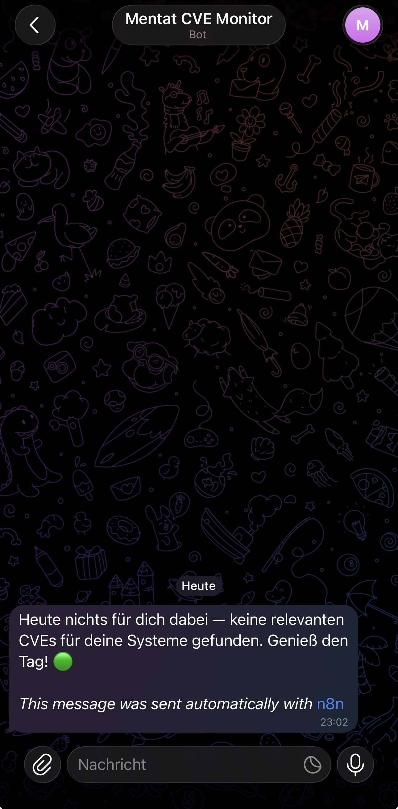

# N8N CVE Monitor

Persönlicher Security-Bot der täglich relevante CVEs filtert, per KI zusammenfasst und via Telegram meldet.

---

## Workflow


**Pipeline:**
`Schedule Trigger` → `HTTP Request (NVD API)` → `Code in JavaScript (Filter)` → `IF` → `HTTP Request (Ollama)` → `Send a text message (Telegram)`

---

## Beispiel-Output



---

## Nodes im Detail

### Schedule Trigger
- Täglich **08:00 Uhr** (Berlin)

### HTTP Request2 — NVD API
- `GET https://services.nvd.nist.gov/rest/json/cves/2.0`
- Query Parameter:
  - `pubStartDate` → `{{ $now.minus(1, 'day').toISO() }}`
  - `pubEndDate` → `{{ $now.toISO() }}`
  - `resultsPerPage` → `50`
- Kein API Key nötig, kostenlos

### Code in JavaScript1 — Filter & Aufbereitung
Filtert CVEs nach relevanten Systemen. Gibt `NONE`-Item zurück wenn nichts gefunden.

**Überwachte Systeme:**
- Raspberry Pi OS Lite (`raspberry`, `raspbian`, `debian`, `bcm2835`, `broadcom`)
- Nobara OS (`fedora`, `nobara`, `rhel`)
- Windows 11 (`windows 11`, `windows 10`, `microsoft windows`)
- Kali Linux / SSH / Crypto (`kali`, `openssh`, `openssl`)
- Linux allgemein (`linux kernel`, `arm`, `aarch64`, `systemd`, `glibc`)

**Vollständiger Code:**
```javascript
const data = $input.first().json;
const vulns = data.vulnerabilities || [];

const keywords = [
  'raspberry', 'raspbian', 'debian', 'bcm2835', 'broadcom',
  'fedora', 'nobara', 'rhel',
  'windows 11', 'windows 10', 'microsoft windows',
  'kali', 'openssh', 'openssl',
  'linux kernel', 'arm', 'aarch64', 'systemd', 'glibc'
];

if (vulns.length === 0) {
  return [{
    json: {
      id: 'NONE',
      description: 'Heute keine CVEs in den letzten 24h veröffentlicht. Alles ruhig.',
      published: new Date().toISOString(),
      score: 'N/A'
    }
  }];
}

const relevant = vulns.filter(v => {
  const desc = (v.cve.descriptions || [])
    .find(d => d.lang === 'en')?.value?.toLowerCase() || '';
  return keywords.some(kw => desc.includes(kw));
});

if (relevant.length === 0) {
  return [{
    json: {
      id: 'NONE',
      description: 'Heute nichts für dich dabei — keine relevanten CVEs für deine Systeme gefunden. Genieß den Tag! 🟢',
      published: new Date().toISOString(),
      score: 'N/A'
    }
  }];
}

return relevant.slice(0, 10).map(v => {
  const cve = v.cve;
  const id = cve.id;
  const description = ((cve.descriptions || []).find(d => d.lang === 'en')?.value || 'No description')
    .replace(/[\r\n\t]/g, ' ')
    .replace(/"/g, "'");
  const published = cve.published;

  const cvssV31 = cve.metrics?.cvssMetricV31?.[0]?.cvssData;
  const cvssV30 = cve.metrics?.cvssMetricV30?.[0]?.cvssData;
  const cvss = cvssV31 || cvssV30;
  const score = cvss ? `${cvss.baseScore} (${cvss.baseSeverity})` : 'N/A';

  return { json: { id, description, published, score } };
});
```

### IF — Relevanz-Check
- `{{ $json.id }}` is not equal to `NONE`
- **true** → Ollama (LLM-Zusammenfassung)
- **false** → direkt Telegram (kein unnötiger LLM-Call)

### HTTP Request3 — Ollama (hailo-ollama)
- `POST http://<HAILO-HOST>:8000/api/chat`
- Modell: `qwen2.5-instruct:1.5b`
- `stream: false`

**JSON Body:**
```json
{
  "model": "qwen2.5-instruct:1.5b",
  "messages": [
    {
      "role": "system",
      "content": "Du bist ein Security-Assistent. Antworte IMMER auf Deutsch. Niemals auf Englisch oder Chinesisch."
    },
    {
      "role": "user",
      "content": "Fasse diese CVE kurz auf Deutsch zusammen — maximal 3 Sätze, kein Fachjargon.\n\nID: {{ $json.id }}\nBeschreibung: {{ $json.description }}\nCVSS Score: {{ $json.score }}\nVeröffentlicht: {{ $json.published }}"
    }
  ],
  "stream": false
}
```

### Send a text message — Telegram
- Text: `{{ $json.message?.content ?? $json.description }}`

---

## Verhalten

| Situation | Verhalten |
|-----------|-----------|
| Relevante CVEs gefunden | Ollama fasst zusammen → Telegram |
| Keine relevanten CVEs | Direkt Telegram: „Heute nichts für dich dabei 🟢" |
| NVD API liefert nichts | Telegram: „Heute keine CVEs veröffentlicht. Alles ruhig." |

---

## Infrastruktur

| Komponente | Details |
|------------|---------|
| N8N | Docker Container auf `mentat-ai-node` |
| hailo-ollama | Nativer Prozess auf Pi, Port 8000, Hailo-8 NPU |
| Modelle verfügbar | `qwen2.5-instruct:1.5b`, `llama3.2:3b`, `qwen2:1.5b` |
| NVD API | Kostenlos, kein Account nötig |

---

## Changelog

### v2.1 — 02.04.2026
- `resultsPerPage` auf 50 erhöht
- Keywords bereinigt — generische Tools entfernt
- System Role im Ollama Prompt → kein Chinesisch mehr
- Sonderzeichen in Descriptions werden bereinigt → kein JSON-Fehler mehr

### v2.0 — 02.04.2026
- RSS Feed ersetzt durch NVD API 2.0
- XML Node entfernt
- Keyword-Filter für eigene Systeme hinzugefügt
- IF Node: Ollama wird übersprungen wenn keine relevanten CVEs
- Feedback auch bei leerem Ergebnis
- Prompt auf Deutsch, persönlicher Ton

### v1.0
- NVD RSS Feed → XML → Code (top 10 slice) → Ollama → Telegram
- Problem: alte CVEs aus RSS, LLM halluzinierte mangels echter Descriptions
