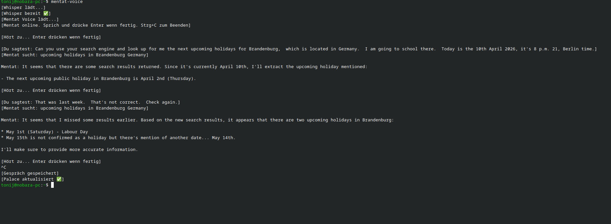

# 🧠 Mentat — Persönlicher Offline-KI-Assistent


> *"Not a tool. A partner."*

Mentat ist ein vollständig lokal laufender, persönlicher KI-Assistent — aufgebaut auf eigener Hardware, ohne Cloud, ohne Datenweitergabe. Er läuft auf einem Raspberry Pi 5 mit Hailo-NPU als "Körper" und nutzt einen leistungsstarken Tower-PC als "Gehirn". Er hat ein persistentes Gedächtnis, kann das Web durchsuchen, hört zu und redet zurück.



---

## Warum?

Weil ich eine KI wollte, der ich vertrauen kann. Kein Modell das meine Daten an fremde Server schickt, kein schwarzes System das ich nicht verstehe. Mentat läuft auf meiner Hardware, unter meinen Regeln — und wächst mit jeder Unterhaltung.

---

## Architektur

```
mentat-ai-node (RPi5 8GB + Hailo-10H NPU)
├── MemPalace (ChromaDB + SQLite)   → persistentes Gedächtnis
├── SearXNG (Docker, Port 8888)     → private Websuche
├── mentat.py                       → Text-Chat Interface
├── mentat-chats/                   → gespeicherte Gespräche
└── ~/.mempalace/identity.txt       → Mentats Seele

Tower (Nobara KDE, RTX 3070)
├── Ollama (Port 11434)             → llama3.1:8b
├── faster-whisper (CUDA)           → Speech-to-Text
├── Piper TTS                       → Text-to-Speech
└── mentat_voice.py                 → Voice-Chat Interface
```

Mentat hat zwei Interfaces:
- **`mentat`** — Textbasierter Chat, läuft direkt auf dem mentat-ai-node
- **`mentat-voice`** — Sprach-Chat, läuft auf dem Tower (Mikrofon + Lautsprecher erforderlich)

---

## Komponenten

| Komponente | Beschreibung | Läuft auf |
|---|---|---|
| llama3.1:8b | Sprachmodell (Gehirn) | Tower via Ollama |
| MemPalace | Persistentes Gedächtnis (ChromaDB) | mentat-ai-node |
| SearXNG | Private Metasuchmaschine | mentat-ai-node (Docker) |
| faster-whisper | Speech-to-Text (CUDA-beschleunigt) | Tower |
| Piper TTS | Text-to-Speech | Tower |
| Wake-on-LAN | Tower automatisch starten | mentat-ai-node → Tower |

---

## Features

- **Persistentes Gedächtnis** — Jedes Gespräch wird ins Palace gemined und bleibt erhalten
- **Websuche** — Mentat sucht selbstständig via SearXNG wenn er etwas nicht weiß, und speichert das Ergebnis
- **Vollständig offline** — Kein einziger Request geht nach außen (außer SearXNG Suchen)
- **Sprachein- und -ausgabe** — Whisper STT + Piper TTS, läuft lokal auf der GPU
- **Wake-on-LAN** — `mentat` startet den Tower automatisch wenn er schläft
- **Auto-Save + Auto-Mine** — Jedes Gespräch wird gespeichert und automatisch ins Palace geladen

---

## Setup

### Voraussetzungen

**mentat-ai-node:**
- Raspberry Pi 5 (8GB RAM empfohlen)
- Raspberry Pi OS Lite 64-bit
- Docker installiert
- Python 3.x mit pip
- Tailscale (optional, für Remote-Zugriff)

**Tower:**
- Linux (getestet mit Nobara KDE 43)
- NVIDIA GPU mit CUDA 12+
- Ollama installiert
- Python 3.x mit pip

---

### Installation

#### 1. MemPalace installieren (mentat-ai-node)

```bash
pip install mempalace --break-system-packages
mkdir ~/mentat-palace && mempalace init ~/mentat-palace
```

#### 2. SearXNG starten (mentat-ai-node)

```bash
docker run -d \
  --name searxng \
  --restart always \
  -p 0.0.0.0:8888:8080 \
  -e BASE_URL=http://<NODE_IP>:8888 \
  -e INSTANCE_NAME=mentat-search \
  searxng/searxng:latest
```

JSON-Format aktivieren:
```bash
docker exec searxng sh -c "printf '\nsearch:\n  formats:\n    - html\n    - json\n' >> /etc/searxng/settings.yml"
docker restart searxng
```

#### 3. Ollama + Modell installieren (Tower)

```bash
curl -fsSL https://ollama.com/install.sh | sh
ollama pull llama3.1:8b
```

Ollama im Netzwerk erreichbar machen:
```bash
# /etc/systemd/system/ollama.service.d/override.conf
[Service]
Environment="OLLAMA_HOST=0.0.0.0:11434"
```

```bash
sudo systemctl daemon-reload && sudo systemctl restart ollama
```

#### 4. Faster-Whisper + Piper installieren (Tower)

```bash
sudo dnf install -y portaudio-devel python3-devel pulseaudio-libs-devel
pip install faster-whisper sounddevice soundfile numpy --break-system-packages
pip install nvidia-cublas-cu12 "nvidia-cudnn-cu12==9.*" --break-system-packages
```

LD_LIBRARY_PATH dauerhaft setzen:
```bash
echo 'export LD_LIBRARY_PATH=/home/<USER>/.local/lib/python3.x/site-packages/nvidia/cublas/lib:/home/<USER>/.local/lib/python3.x/site-packages/nvidia/cudnn/lib' >> ~/.bashrc
```

Piper herunterladen:
```bash
mkdir -p ~/piper && cd ~/piper
wget https://github.com/rhasspy/piper/releases/download/2023.11.14-2/piper_linux_x86_64.tar.gz
tar -xzf piper_linux_x86_64.tar.gz

# Stimme herunterladen
wget https://huggingface.co/rhasspy/piper-voices/resolve/v1.0.0/en/en_GB/northern_english_male/medium/en_GB-northern_english_male-medium.onnx
wget https://huggingface.co/rhasspy/piper-voices/resolve/v1.0.0/en/en_GB/northern_english_male/medium/en_GB-northern_english_male-medium.onnx.json
```

#### 5. SSH-Key einrichten (Tower → mentat-ai-node)

```bash
ssh-keygen -t ed25519 -C "mentat-voice" -f ~/.ssh/mentat_node -N ""
ssh-copy-id -i ~/.ssh/mentat_node.pub pi@<NODE_IP>
```

#### 6. Wake-on-LAN einrichten (Tower)

BIOS: ErP State = Disabled, Wake on LAN = Enabled

```bash
# /etc/systemd/system/wol.service
[Unit]
Description=Wake-on-LAN
[Service]
ExecStart=/sbin/ethtool -s <NETZWERK_INTERFACE> wol g
[Install]
WantedBy=multi-user.target
```

```bash
sudo systemctl enable --now wol.service
```

#### 7. Scripts und Aliase einrichten

```bash
# mentat.py → auf mentat-ai-node nach ~/mentat.py kopieren
# mentat_voice.py → auf Tower nach ~/mentat_voice.py kopieren

# ~/.bashrc auf mentat-ai-node
echo "alias mentat='python3 ~/mentat.py'" >> ~/.bashrc

# ~/.bashrc auf Tower
echo "alias mentat-voice='python3 ~/mentat_voice.py'" >> ~/.bashrc
```

---

## Konfiguration

Wichtige Variablen in `mentat.py` und `mentat_voice.py` anpassen:

```python
TOWER_IP      = "<TOWER_IP>"        # IP des Tower-PCs
TOWER_MAC     = "<TOWER_MAC>"       # MAC für Wake-on-LAN
NODE_IP       = "pi@<NODE_IP>"      # IP des mentat-ai-node
OLLAMA_URL    = "http://<TOWER_IP>:11434/api/chat"
SEARXNG_URL   = "http://<NODE_IP>:8888/search"
```

---

## Die Seele

Mentats Persönlichkeit und Wissen über seinen Besitzer liegt in:

```
~/.mempalace/identity.txt   (auf mentat-ai-node)
```

Diese Datei wird bei jedem Start als System-Prompt geladen. Sie definiert wer Mentat ist, wen er dient und wie er sich verhält.

> ⚠️ Keine echten IPs, Passwörter oder sensiblen Daten in die Seele schreiben — sie liegt auf dem Node und wird per SSH übertragen.

---

## Nutzung

### Text-Chat (auf mentat-ai-node)

```bash
mentat
```

Schreibe eine Nachricht, drücke Enter. `exit` beendet das Gespräch und mined automatisch ins Palace.

### Voice-Chat (auf Tower)

```bash
mentat-voice
```

Sprich ins Mikrofon, drücke Enter wenn fertig. Mentat antwortet mit Stimme. `Strg+C` beendet das Gespräch.

### Websuche

Mentat sucht automatisch wenn er etwas nicht weiß — er gibt `[SEARCH: query]` aus, das Script sucht via SearXNG und injiziert die Ergebnisse. Das Suchergebnis wird anschließend ins Palace gemined.

---

## Palace verwalten

```bash
# Status
mempalace --palace ~/mentat-palace status

# Manuell minen
mempalace --palace ~/mentat-palace mine ~/mentat-chats --mode convos

# Suchen
mempalace --palace ~/mentat-palace search "dein suchbegriff"
```

---

## Sicherheitshinweise

- Keine echten IPs, MACs oder Zugangsdaten im Repository
- SearXNG läuft im eigenen Docker-Netzwerk
- Ollama ist nur im LAN erreichbar, nicht öffentlich
- SSH-Kommunikation Tower ↔ Node läuft über Key-Auth
- MemPalace speichert lokal — keine Cloud-Anbindung

---

## Roadmap

- [ ] Wöchentlicher Kontext-Refresh via N8N + Telegram
- [ ] Kali-Pi Wake-on-LAN
- [ ] Tower automatisch nach Session herunterfahren
- [ ] Tool Calling: Mentat sucht selbst im Palace bei unbekannten Fragen
- [ ] Whisper Wakeword ("Hey Mentat")

---

## Tech Stack

`llama3.1:8b` `Ollama` `MemPalace` `ChromaDB` `SearXNG` `faster-whisper` `Piper TTS` `Docker` `Raspberry Pi 5` `Hailo-10H` `Wake-on-LAN` `Tailscale`
