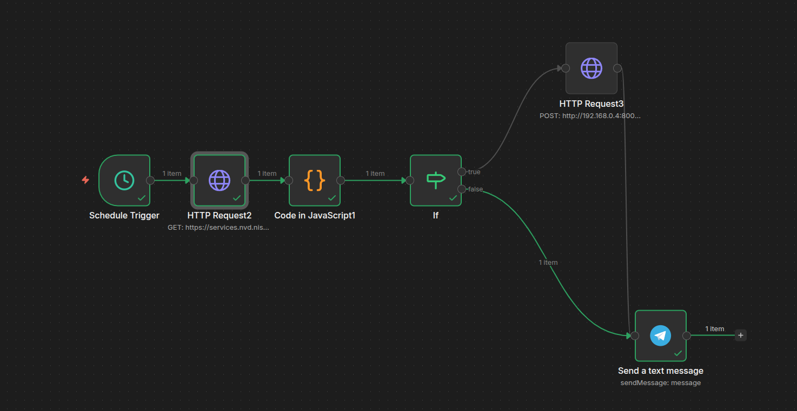
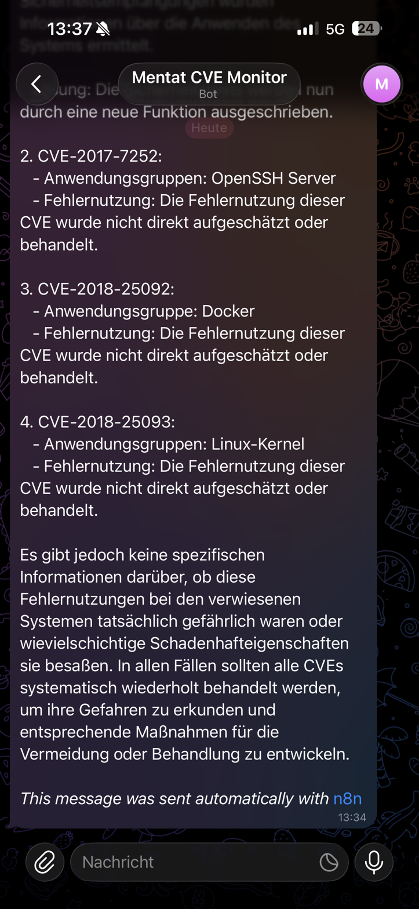

# N8N CVE Monitor

Persönlicher Security-Bot der täglich relevante CVEs filtert, per KI zusammenfasst und via Telegram meldet.

---

## Workflow

**Pipeline:**
`Schedule Trigger` → `HTTP Request (NVD API)` → `Code in JavaScript (Filter)` → `IF` → `HTTP Request (Ollama)` → `Send a text message (Telegram)`

---

## Beispiel-Output

---

## Nodes im Detail

### Schedule Trigger
- Täglich **08:00 Uhr** (Berlin)

### HTTP Request2 — NVD API
- `GET https://services.nvd.nist.gov/rest/json/cves/2.0`
- Query Parameter:
  - `pubStartDate` → `{{ $now.minus(1, 'day').toISO() }}`
  - `pubEndDate` → `{{ $now.toISO() }}`
  - `resultsPerPage` → `20`
- Kein API Key nötig, kostenlos

### Code in JavaScript1 — Filter & Aufbereitung
Filtert CVEs nach relevanten Systemen. Gibt `NONE`-Item zurück wenn nichts gefunden.

**Überwachte Systeme:**
- Raspberry Pi OS Lite (`raspberry`, `raspbian`, `debian`)
- Nobara OS (`fedora`, `nobara`)
- Windows 11 (`windows 11`, `microsoft windows`)
- Kali Linux / SSH (`kali`, `openssh`, `ssh`)
- Allgemein (`linux kernel`, `arm`, `aarch64`)

### IF — Relevanz-Check
- `{{ $json.id }}` is not equal to `NONE`
- **true** → Ollama (LLM-Zusammenfassung)
- **false** → direkt Telegram (kein unnötiger LLM-Call)

### HTTP Request3 — Ollama (hailo-ollama)
- `POST http://<HAILO-HOST>:8000/api/chat`
- Modell: `qwen2.5-instruct:1.5b`
- `stream: false`

**Prompt:**
> Du bist ein persönlicher Security-Assistent. Fasse diese CVE kurz und klar auf Deutsch zusammen — so als würdest du einem Freund erklären warum er aufpassen soll. Maximal 3 Sätze. Kein Fachjargon, kein Roboter-Ton.

### Send a text message — Telegram
- Text: `{{ $json.message?.content ?? $json.description }}`

---

## Verhalten

| Situation | Verhalten |
|-----------|-----------|
| Relevante CVEs gefunden | Ollama fasst zusammen → Telegram |
| Keine relevanten CVEs | Direkt Telegram: „Heute nichts für dich dabei 🟢" |
| NVD API liefert nichts | Telegram: „Heute keine CVEs veröffentlicht. Alles ruhig." |

---

## Infrastruktur

| Komponente | Details |
|------------|---------|
| N8N | Docker Container auf `mentat-ai-node` |
| hailo-ollama | Nativer Prozess auf Pi, Port 8000, Hailo-8 NPU |
| Modelle verfügbar | `qwen2.5-instruct:1.5b`, `llama3.2:3b`, `qwen2:1.5b` |
| NVD API | Kostenlos, kein Account nötig |

---

## Changelog

### v2.0 — 02.04.2026
- RSS Feed ersetzt durch NVD API 2.0 → echte strukturierte CVE-Daten
- XML Node entfernt
- Keyword-Filter für eigene Systeme hinzugefügt
- IF Node: Ollama wird übersprungen wenn keine relevanten CVEs
- Feedback auch bei leerem Ergebnis (kein stilles Scheitern)
- Prompt auf Deutsch, persönlicher Ton
- Telegram Message Field: `$json.message?.content ?? $json.description`

### v1.0
- NVD RSS Feed → XML → Code (top 10 slice) → Ollama → Telegram
- Problem: alte CVEs aus RSS, LLM halluzinierte mangels echter Descriptions
